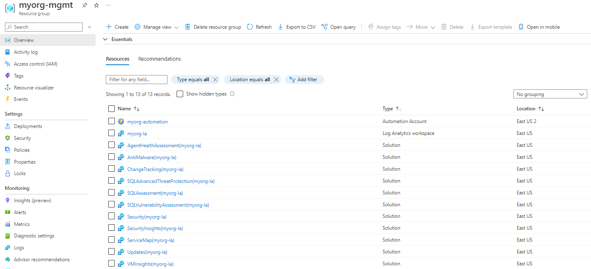

## Overview

This page describes how to deploy Enterprise-scale management resources custom configuration, including guidance on how to apply Log Analytics and Azure Security Center preferences.
In this example, we take a default configuration and make the following code changes:

### Enable and configure management resources (Level 200)
- Set and enable the `configure_management_resources`  variable
- Add parameters for enabling/disabling management resources
- Add parameters to set location and resource tags
- Create custom configurations for Log Analytics and ASC


The module allows for further configuration of log analytics and azure security center by setting the `configure_management_resources` variable. 
This configuration requires three mandatory variables:
     location: where the resource group will be deployed
     advanced:  [tbd]
     tags: add any specific tag that the resources permit

For this configuration you must pass in both log analytics and security center. If you want to disable
either or both of these resources, set the enabled flag to *false*.

```hcl
    settings = {
      log_analytics = {
        enabled = false
     }
```
If you've already deployed management resources, this will allow you to enable or disable specific parameters.
Every parameter set to true will create new principal id's that will force replacement in place of the existing
roles and policies to reassign them to the log analytics and sentinel resources specified. Likewise, if set to false, existing configurations will be removed.  

If location is not specified, the resources will default to *eastus*
```hcl
    terraform {
      required_providers {
        azurerm = {
            source = "hashicorp/azurerm"
            version = ">=2.46.1"
        }
   
     }
    }

    provider "azurerm"{
    features {}
    }

    #Pull current Tenant ID from connection settings and store to data source
    
    data "azurerm_client_config" current {}

    module "enterprise_scale" {
      source = "Azure/caf-enterprise-scale/azurerm"
      version = "0.3.1"

    root_parent_id = data.azurerm_client_config.current.tenant_id
    root_id = "contoso" 
    root_name = "Contoso"
    deploy_management_resources = "true"
    subscription_id_management = "<insert_subscription_id>" 
    configure_management_resources = {
        settings = {
      log_analytics = {
        enabled = true
        config = {
          retention_in_days                           = 30
          enable_monitoring_for_arc                   = true
          enable_monitoring_for_vm                    = true
          enable_monitoring_for_vmss                  = true
          enable_solution_for_agent_health_assessment = true
          enable_solution_for_anti_malware            = false
          enable_solution_for_azure_activity          = true
          enable_solution_for_change_tracking         = true
          enable_solution_for_service_map             = false
          enable_solution_for_sql_assessment          = true
          enable_solution_for_updates                 = true
          enable_solution_for_vm_insights             = true
          enable_sentinel                             = true
        }
      }
      security_center = {
        enabled = true
        config = {
          email_security_contact             = "email@contoso.com"
          enable_defender_for_acr            = true
          enable_defender_for_app_services   = true
          enable_defender_for_arm            = true
          enable_defender_for_dns            = true
          enable_defender_for_key_vault      = true
          enable_defender_for_kubernetes     = false
          enable_defender_for_servers        = true
          enable_defender_for_sql_servers    = true
          enable_defender_for_sql_server_vms = true
          enable_defender_for_storage        = true
        }
      }
        }
    location = "centralus"
      advanced = null
      tags     = null
      }
    }
```
You should now have a deployment as seen below



IMPORTANT: Log Analytics and Security Center policies must enabled in order to deploy

If you are using an `archetype_exclusion_root.json` in your code, make sure to  not disable Log Analytics or Security Center policies when using this module. ASC and Log Analytics will fail to deploy if the required policies are not in place. Here is an example of an exclusion that will not deploy Log Analytics or Security Center:

```json
{
  "exclude_es_root": {
    "policy_assignments": [
      "Deploy-ASC-Monitoring",
      "Deploy-ASC-Defender",
      "Deploy-Log-Analytics"
    ],
    "policy_definitions": [],
    "policy_set_definitions": [],
    "role_definitions": [],
    "archetype_config": {
      "parameters": {},
      "access_control": {}
    }
  }
}
```

The module will see that it's not allowed to assign the required policies and will **not** create the resources. This follows the Enterprise Scale principle of governance by default ensuring that deploy if not exist create the resources and their required dependencies automatically.
