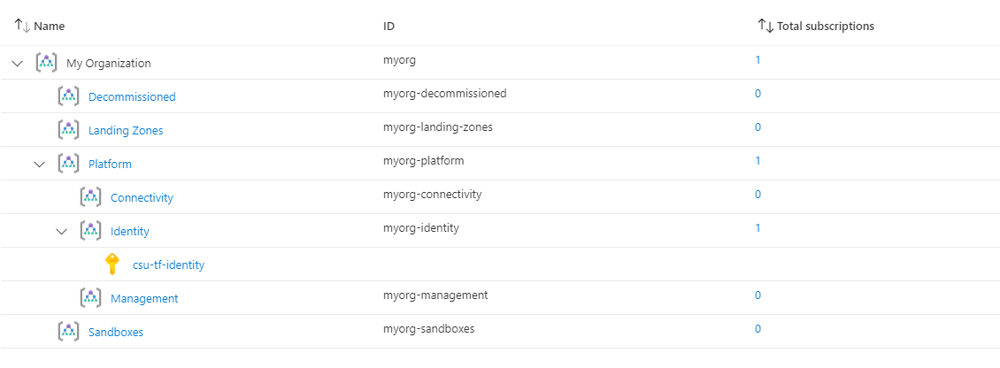

<!-- markdownlint-disable first-line-h1 -->
## Overview

This page describes how to deploy Enterprise-scale with the [Identity resources][wiki_identity_resources] created in the current Subscription context, using the default configuration settings.

Unlike the `connectivity` and `management` solutions, no resources are currently deployed when enabling `deploy_identity_resources`.
Instead, the Policy Assignments associated with the `identity` Management Group are enabled and configured based on the optional `configure_identity_resources` input variable.
The module will also move the Subscription specified in `subscription_id_identity` to the `identity` Management Group, unless it is the same value specified in `subscription_id_connectivity` or `subscription_id_management`.

In this example, we take the [default configuration][wiki_deploy_default_configuration] and make the following changes:

- Set `deploy_identity_resources` to enable configuration of Policy Assignments associated with the `identity` Management Group.
- Set the `subscription_id_identity` value to ensure the Subscription is moved to the correct Management Group, and policies are updated with the correct values.

The module updates the `parameters` and `enforcement_mode` for a number of Policy Assignments, to enable features designed to protect resources in the `identity` Subscription including:

- Disable creation of Public IP resources;
- Disable RDP connectivity from the Internet;
- Enforce NSG on Subnets;
- Enable Azure Backup for VMs;

> IMPORTANT: Ensure the module version is set to the latest, and don't forget to run `terraform init` if upgrading to a later version of the module.


## Example root module

To create the Identity resources, `deploy_identity_resources` must be set to `true`, and the `subscription_id_identity` is also required.

> TIP: The exact number of resources created depends on the module configuration, but you can expect upwards of 180 resources to be created by the module for this example.

To keep this example simple, the root module for this example is based on a single file:

**`main.tf`**

```hcl
# We strongly recommend using the required_providers block to set the
# Azure Provider source and version being used.

terraform {
  required_providers {
    azurerm = {
      source  = "hashicorp/azurerm"
      version = ">= 3.0.2"
    }
  }
}

provider "azurerm" {
  features {}
}

# You can use the azurerm_client_config data resource to dynamically
# extract connection settings from the provider configuration.

data "azurerm_client_config" "core" {}

# Call the caf-enterprise-scale module directly from the Terraform Registry
# pinning to the latest version

module "enterprise_scale" {
  source  = "Azure/caf-enterprise-scale/azurerm"
  version = "2.1.0"

  providers = {
    azurerm              = azurerm
    azurerm.connectivity = azurerm
    azurerm.management   = azurerm
  }

  root_parent_id = data.azurerm_client_config.core.tenant_id
  root_id        = "myorg"
  root_name      = "My Organization"

  deploy_identity_resources = true
  subscription_id_identity  = data.azurerm_client_config.core.subscription_id

}
```

## Deployed Management Groups



You have successfully created the default Management Group resource hierarchy, along with the recommended Azure Policy and Access control (IAM) settings for Enterprise-scale.

You have also assigned the current Subscription from your provider configuration to the `identity` Management Group.

## Policy Assignment configuration

Check the following Policy Assignments to see how these have been configured with default settings for parameters and enforcement mode:

- Scope = `identity`
  - `Deny-Public-IP`
  - `Deny-RDP-From-Internet`
  - `Deny-Subnet-Without-Nsg`
  - `Deploy-VM-Backup`

> You may want to [Deploy Identity Resources With Custom Settings][wiki_deploy_identity_resources_custom] to change some of these settings.

### Policy Assignment parameters example

The following shows the `Deploy-VM-Backup` Policy Assignment with a user-defined values set by the module for the parameters.


### Policy Assignment compliance

Unless you have deployed resources into the current Subscription context used for your deployment, there shouldn't be any resources reporting a compliance state.

## Deployed Identity resources

No resources will be deployed in your `identity` Subscription by this module.

## Additional considerations

If you are using [Archetype Exclusions][archetype_exclusions] or [custom Archetypes][custom_archetypes] in your code, make sure to not disable the managed policies ([listed above](#policy-assignment-configuration)) if you require policy integration using this module.
The relationship between the resources deployed and the Policy parameters is dependent on [specific Policy Assignments](#policy-assignment-configuration) being used.

## Next steps

Go to our next example to learn how to deploy the [Identity resources with custom settings][wiki_deploy_identity_resources_custom].

To learn more about module configuration using input variables, please refer to the [Module Variables](%5BUser-Guide%5D-Module-Variables) documentation.

Looking for further inspiration? Why not try some of our other [examples][wiki_examples]?

[//]: # "************************"
[//]: # "INSERT LINK LABELS BELOW"
[//]: # "************************"

[wiki_identity_resources]:               %5BUser-Guide%5D-Identity-Resources "Wiki - Identity Resources"
[wiki_deploy_identity_resources_custom]: %5BExamples%5D-Deploy-Identity-Resources-With-Custom-Settings "Wiki - Deploy Identity Resources With Custom Settings"
[wiki_examples]:                         Examples "Wiki - Examples"
[wiki_deploy_default_configuration]:     %5BExamples%5D-Deploy-Default-Configuration "Wiki - Deploy Default Configuration"

[archetype_exclusions]: %5BExamples%5D-Expand-Built-in-Archetype-Definitions#to-enable-the-exclusion-function "Wiki - Expand Built-in Archetype Definitions # To enable the exclusion function"
[custom_archetypes]:    %5BUser-Guide%5D-Archetype-Definitions "[User Guide] Archetype Definitions"
