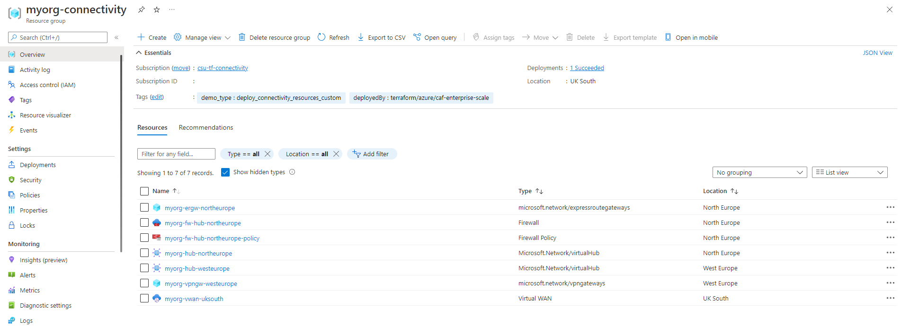
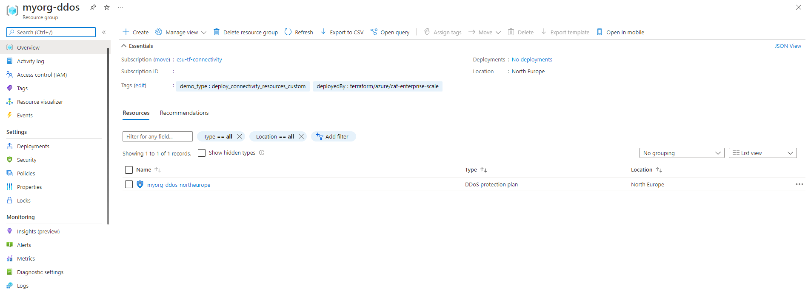
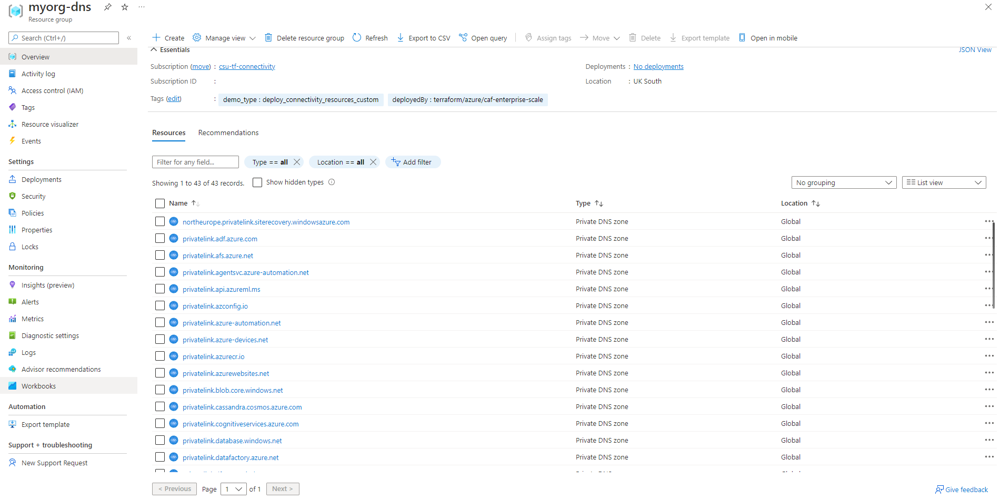

<!-- markdownlint-disable first-line-h1 -->
## Overview

This page describes how to deploy Azure landing zones with connectivity resources based on the [Virtual WAN network topology (Microsoft-managed)][wiki_connectivity_resources_virtual_wan] created in the current Subscription context, using custom configuration settings.

> **NOTE:**
> If you need to deploy a network based on traditional virtual networks, please see our [Deploy Connectivity Resources With Custom Settings (Hub and Spoke)][wiki_deploy_connectivity_resources_custom] example.

<!-- markdownlint-disable-next-line no-blanks-blockquote-->
> **WARNING:**
> This deployment includes resource types which can incur increased consumption costs. Please take care to review the resources being deployed before proceeding.

The module supports customizing almost any part of the configuration, however each subset of resources has it's own configuration block which is designed to simplify setting specific options.
For the connectivity resources, this is configured through the [`configure_connectivity_resources`][wiki_configure_connectivity_resources] input variable.

In this example, we take the base [Deploy Connectivity Resources (Virtual WAN)][wiki_deploy_virtual_wan_resources] configuration and make the following changes:

<!-- markdownlint-disable no-inline-html -->
- Add input variable on the root module for enabling/disabling connectivity resources
- Add a local variable for `configure_connectivity_resources` and set custom values for the following:
  - Deploy a shared DDoS Network Protection plan in the `northeurope` region
  - Deploy virtual hubs to `northeurope` and `westeurope`
  - Deploy an ExpressRoute gateway and Azure Firewall to the virtual hub in `northeurope`
  - Deploy a VPN gateway to the virtual hub in `westeurope`
  - Ensure private DNS zones for private endpoints are enabled for `northeurope` and `westeurope` regions <sup>1</sup>
  - Set a different default location for connectivity resources (*controlled through an input variable on the root module*)
  - Add custom resource tags for connectivity resources (*controlled through an input variable on the root module*)

> <sup>1</sup> - The domain namespace for some private endpoints (e.g. Azure Batch) are bound to a specific Azure Region.
By default, the module will use the location set by the `configure_connectivity_resources.location` value, or the `default_location` value (`eastus`), in order of precedence.
To deploy private DNS zones to more locations for these resource types, update the `configure_connectivity_resources.settings.dns.config.private_link_locations` value to reflect the locations you want to enable.
Each value in this list must be in the shortname format (`uksouth`), and not DisplayName (`UK South`).
Setting this value will overwrite the default value.
<!-- markdownlint-enable no-inline-html -->

The module allows for further customization of the connectivity resources through the `advanced` setting, however this is out-of-scope for this example.

> Use of the `advanced` setting is currently undocumented and experimental.
Please be aware that using this setting may result in future breaking changes.

If you've already deployed the [virtual WAN resources using default settings][wiki_deploy_virtual_wan_resources], you will be able to see the changes made when moving to this configuration.

If the `configure_connectivity_resources.location` value is not specified, the resources will default to the same location set by the [`default_location`][wiki_default_location] input variable.

> **IMPORTANT:**
> Ensure the module version is set to the latest, and don't forget to run `terraform init` if upgrading to a later version of the module.


## Example root module

To make the code easier to maintain when extending your configuration, we recommend splitting the root module into multiple files. For the purpose of this example, we use the following:

- [terraform.tf](#terraformtf)
- [variables.tf](#variablestf)
- [main.tf](#maintf)
- [settings.connectivity.tf](#settingsconnectivitytf)

> **TIP:**
> The exact number of resources created depends on the module configuration, but you can expect upwards of 230 resources to be created by the module for this example.

### `terraform.tf`

The `terraform.tf` file is used to set the provider configuration, including pinning to a specific version (or range of versions) for the AzureRM Provider. For production use, we recommend pinning to a specific version, and not using ranges.

```hcl
# Configure Terraform to set the required AzureRM provider
# version and features{} block.

terraform {
  required_providers {
    azurerm = {
      source  = "hashicorp/azurerm"
      version = "~> 3.84"
    }
  }
}

provider "azurerm" {
  features {}
}
```

If you wish to deploy the connectivity resources to a different subscription context than the one used for core resources, please refer to our guide for [multi-subscription deployment][wiki_provider_configuration_multi].

### `variables.tf`

The `variables.tf` file is used to declare a couple of example variables which are used to customize deployment of this root module. Defaults are provided for simplicity, but these should be replaced or over-ridden with values suitable for your environment.

```hcl
# Use variables to customize the deployment

variable "root_id" {
  type    = string
  default = "myorg"
}

variable "root_name" {
  type    = string
  default = "My Organization"
}

variable "deploy_connectivity_resources" {
  type    = bool
  default = true
}

variable "connectivity_resources_location" {
  type    = string
  default = "uksouth"
}

variable "connectivity_resources_tags" {
  type = map(string)
  default = {
    demo_type = "deploy_connectivity_resources_custom"
  }
}
```

### `main.tf`

The `main.tf` file contains the `azurerm_client_config` resource, which is used to determine the Tenant ID and Subscription ID values from your user connection to Azure. These are used to ensure the deployment will target your `Tenant Root Group` by default, and to populate the `subscription_id_connectivity` input variable.

It also contains the module declaration for this module, containing a number of customizations as needed to meet the specification defined in the overview above.

```hcl
# Get the current client configuration from the AzureRM provider.
# This is used to populate the root_parent_id variable with the
# current Tenant ID used as the ID for the "Tenant Root Group"
# Management Group.

data "azurerm_client_config" "core" {}

# Declare the Azure landing zones Terraform module
# and provide a base configuration.

module "enterprise_scale" {
  source  = "Azure/caf-enterprise-scale/azurerm"
  version = "<version>" # change this to your desired version, https://www.terraform.io/language/expressions/version-constraints

  default_location = "<YOUR_LOCATION>"

  providers = {
    azurerm              = azurerm
    azurerm.connectivity = azurerm
    azurerm.management   = azurerm
  }

  root_parent_id = data.azurerm_client_config.core.tenant_id
  root_id        = var.root_id
  root_name      = var.root_name

  deploy_connectivity_resources    = var.deploy_connectivity_resources
  subscription_id_connectivity     = data.azurerm_client_config.core.subscription_id
  configure_connectivity_resources = local.configure_connectivity_resources
}
```

### `settings.connectivity.tf`

The `settings.connectivity.tf` file contains a local variable containing the custom configuration for the `configure_connectivity_resources` input variable.
This helps to keep the module block clean, whilst providing clear separation between settings for different groups of resources.

```hcl
# Configure the connectivity resources settings.
locals {
  configure_connectivity_resources = {
    settings = {
      hub_networks = []
      vwan_hub_networks = [
        {
          enabled = true
          config = {
            address_prefix = "10.200.0.0/22"
            location       = "northeurope"
            sku            = ""
            routes         = []
            expressroute_gateway = {
              enabled = true
              config = {
                scale_unit = 1
                allow_non_virtual_wan_traffic = false
              }
            }
            vpn_gateway = {
              enabled = false
              config = {
                bgp_settings       = []
                routing_preference = ""
                scale_unit         = 1
              }
            }
            azure_firewall = {
              enabled = true
              config = {
                enable_dns_proxy              = true
                dns_servers                   = []
                sku_tier                      = "Standard"
                base_policy_id                = ""
                private_ip_ranges             = []
                threat_intelligence_mode      = ""
                threat_intelligence_allowlist = {}
                availability_zones = {
                  zone_1 = true
                  zone_2 = true
                  zone_3 = true
                }
              }
            }
            spoke_virtual_network_resource_ids        = []
            secure_spoke_virtual_network_resource_ids = []
            enable_virtual_hub_connections            = false
          }
        },
        {
          enabled = true
          config = {
            address_prefix = "10.201.0.0/22"
            location       = "westeurope"
            sku            = ""
            routes         = []
            expressroute_gateway = {
              enabled = false
              config = {
                scale_unit = 1
              }
            }
            vpn_gateway = {
              enabled = true
              config = {
                bgp_settings       = []
                routing_preference = ""
                scale_unit         = 1
              }
            }
            azure_firewall = {
              enabled = false
              config = {
                enable_dns_proxy              = true
                dns_servers                   = []
                sku_tier                      = "Standard"
                base_policy_id                = ""
                private_ip_ranges             = []
                threat_intelligence_mode      = ""
                threat_intelligence_allowlist = {}
                availability_zones = {
                  zone_1 = true
                  zone_2 = true
                  zone_3 = true
                }
              }
            }
            spoke_virtual_network_resource_ids        = []
            secure_spoke_virtual_network_resource_ids = []
            enable_virtual_hub_connections            = false
          }
        },
      ]
      ddos_protection_plan = {
        enabled = true
        config = {
          location = "northeurope"
        }
      }
      dns = {
        enabled = true
        config = {
          location = null
          enable_private_link_by_service = {
            azure_api_management                 = true
            azure_app_configuration_stores       = true
            azure_arc                            = true
            azure_automation_dscandhybridworker  = true
            azure_automation_webhook             = true
            azure_backup                         = true
            azure_batch_account                  = true
            azure_bot_service_bot                = true
            azure_bot_service_token              = true
            azure_cache_for_redis                = true
            azure_cache_for_redis_enterprise     = true
            azure_container_registry             = true
            azure_cosmos_db_cassandra            = true
            azure_cosmos_db_gremlin              = true
            azure_cosmos_db_mongodb              = true
            azure_cosmos_db_sql                  = true
            azure_cosmos_db_table                = true
            azure_data_explorer                  = true
            azure_data_factory                   = true
            azure_data_factory_portal            = true
            azure_data_health_data_services      = true
            azure_data_lake_file_system_gen2     = true
            azure_database_for_mariadb_server    = true
            azure_database_for_mysql_server      = true
            azure_database_for_postgresql_server = true
            azure_digital_twins                  = true
            azure_event_grid_domain              = true
            azure_event_grid_topic               = true
            azure_event_hubs_namespace           = true
            azure_file_sync                      = true
            azure_hdinsights                     = true
            azure_iot_dps                        = true
            azure_iot_hub                        = true
            azure_key_vault                      = true
            azure_key_vault_managed_hsm          = true
            azure_kubernetes_service_management  = true
            azure_machine_learning_workspace     = true
            azure_managed_disks                  = true
            azure_media_services                 = true
            azure_migrate                        = true
            azure_monitor                        = true
            azure_purview_account                = true
            azure_purview_studio                 = true
            azure_relay_namespace                = true
            azure_search_service                 = true
            azure_service_bus_namespace          = true
            azure_site_recovery                  = true
            azure_sql_database_sqlserver         = true
            azure_synapse_analytics_dev          = true
            azure_synapse_analytics_sql          = true
            azure_synapse_studio                 = true
            azure_web_apps_sites                 = true
            azure_web_apps_static_sites          = true
            cognitive_services_account           = true
            microsoft_power_bi                   = true
            signalr                              = true
            signalr_webpubsub                    = true
            storage_account_blob                 = true
            storage_account_file                 = true
            storage_account_queue                = true
            storage_account_table                = true
            storage_account_web                  = true
          }
          private_link_locations = [
            "northeurope",
            "westeurope",
          ]
          public_dns_zones                                       = []
          private_dns_zones                                      = []
          enable_private_dns_zone_virtual_network_link_on_hubs   = true
          enable_private_dns_zone_virtual_network_link_on_spokes = true
          virtual_network_resource_ids_to_link                   = []
        }
      }
    }

    location = var.connectivity_resources_location
    tags     = var.connectivity_resources_tags
    advanced = null
  }
}
```

## Deployed Management Groups


You have successfully created the default management group resource hierarchy, along with the recommended Azure Policy and Access control (IAM) settings for your Azure landing zone.

You have also assigned the current subscription from your provider configuration to the `connectivity` management group.

## Policy Assignment configuration

Check the following policy assignments to see how these have been configured with settings matching your connectivity resources configuration set by `configure_connectivity_resources`:

- Scope = `connectivity` and `landing-zones`
  - `Enable-DDoS-VNET`
- Scope = `corp`
  - `Deploy-Private-DNS-Zones`

These policy assignments should all be assigned with custom parameter values based on your configuration, with `enforcement_mode` correctly set.
Once evaluated, the compliance state should also be updated and you can run remediation tasks to remediate any non-compliant resources.

## Deployed Connectivity resources

Once deployment is complete and policy has run, you should have the following resource groups deployed in your assigned connectivity subscription:


You should see that each of the resource groups are aligned to regions based on the configuration.
In this case, they are set as follows:

- `myorg-asc-export` is set to `East US`, inherited from the module default for `default_location`.
- `myorg-connectivity-northeurope` is set to `North Europe`, set by the hardcoded `settings.hub_networks[0].config.location` value from the local variable `configure_connectivity_resources`.
- `myorg-connectivity-westeurope` is set to `West Europe`, set by the hardcoded `settings.hub_networks[1].config.location` value from the local variable `configure_connectivity_resources`.
- `myorg-ddos` is set to `North Europe`, set by the hardcoded `settings.ddos_protection_plan.config.location` value from the local variable `configure_connectivity_resources`.
- `myorg-dns` is set to `UK South`, set by the default value for `var.connectivity_resources_location` which is assigned to the `settings.location` value from the local variable `configure_connectivity_resources`.
- `NetworkWatcherRG` is set to `West Europe`, matching the first region where a Virtual Network was deployed and remediated by Policy.

In general, the resource group will be set to the same location as the resources within.

> **NOTE:** `myorg-asc-export` is related to the [Management resources][wiki_management_resources].
This should contain a hidden `microsoft.security/automations` resource `ExportToWorkspace` once the [management resources][wiki_management_resources] are configured and Azure Policy has completed remediation.
> `NetworkWatcherRG` is also automatically generated by the Azure platform when at least one virtual network is created within the subscription.

### Resource Group `myorg-connectivity`

The resource group `myorg-connectivity` should be created and contain the following resources:



> As some of these resources are hidden by default, ensure you select `Show hidden types`.

These are now used by the created ExpressRoute gateway and Azure Firewall resources.
DDoS Network Protection should also be set to `Enable` and connected to the DDoS protection plan `myorg-ddos-northeurope`.

### Resource Group `myorg-ddos`

The resource group and DDoS protection plan are created in `northeurope`, as specified via the `configure_connectivity_resources.settings.ddos_protection_plan.config.location` value.

The module creates a single, centralized DDoS protection plan as per the Azure landing zones recommendation.
As such, the resource group name doesn't include the location.



### Resource Group `myorg-dns`

The resource group for DNS is created in `uksouth`, differing to the default config example which used `eastus`.
This is set by the `var.connectivity_resources_location` input variable which set the value for `configure_connectivity_resources.settings.location`.
All private DNS zones are `Global` resources and therefore not bound to a region.



By default the module create a private DNS zone for all services which currently [support private endpoints][azure_private_endpoint_support].
New private DNS zones may be added in future releases as additional services offer private endpoint support.

Using the [private_link_locations][wiki_private_link_locations] input, the module has created private DNS zones for each location specified.
This input overrides the default location value, as used by the resource group.
This provides support for services which use region-bound endpoints:

- `privatelink.northeurope.azmk8s.io`
- `privatelink.ne.backup.windowsazure.com`
- `privatelink.westeurope.azmk8s.io`
- `privatelink.we.backup.windowsazure.com`

> **NOTE:**
> When configuring private endpoints for Azure Backup, note that this service uses a `geo` region code.
> In the example above, this is reflected by `ne` and `we` for North Europe and West Europe.
> For more information, please refer to the Microsoft Docs guidance for [configuring custom DNS or host files when using private endpoints with Azure Backup][azure_backup_private_endpoint].

Because virtual hubs do not support virtual network links, none have been created to connect the private DNS zones to the hub networks.
The module will still create these for any spoke networks specified by the [spoke_virtual_network_resource_ids][wiki_spoke_virtual_network_resource_ids] input.

## Additional considerations

If you are using [archetype exclusions][wiki_archetype_exclusions] or [custom archetypes][wiki_custom_archetypes] in your code, make sure to not disable DDoS or DNS policies if you require policy integration using this module.
The relationship between the resources deployed and the policy parameters are dependent on [specific policy assignments](#policy-assignment-configuration) being used.

## Next steps

Try updating the configuration settings in the `configure_connectivity_resources` local variable to see how this changes your configuration.
Also try setting your own values in the input variables, and toggling the `deploy_connectivity_resources` input variable to see which resources are created/destroyed.

To learn more about module configuration using input variables, please refer to the [Module Variables](%5BUser-Guide%5D-Module-Variables) documentation.

Looking for further inspiration? Why not try some of our other [examples][wiki_examples]?

[//]: # "************************"
[//]: # "INSERT LINK LABELS BELOW"
[//]: # "************************"

[azure_private_endpoint_support]: https://learn.microsoft.com/azure/private-link/private-endpoint-dns#azure-services-dns-zone-configuration "Azure services DNS zone configuration"
[azure_backup_private_endpoint]:  https://learn.microsoft.com/azure/backup/private-endpoints#when-using-custom-dns-server-or-host-files "Configuring custom DNS or host files when using private endpoints with Azure Backup"

[wiki_management_resources]:                 %5BUser-Guide%5D-Management-Resources "Wiki - Management Resources."
[wiki_connectivity_resources_virtual_wan]:   %5BUser-Guide%5D-Connectivity-Resources#virtual-wan-network-topology-microsoft-managed "Wiki - Connectivity Resources - Virtual WAN network topology (Microsoft-managed)"
[wiki_provider_configuration_multi]:         %5BUser-Guide%5D-Provider-Configuration#multi-subscription-deployment "Wiki - Provider Configuration - Multi-Subscription deployment."
[wiki_examples]:                             Examples "Wiki - Examples"
[wiki_archetype_exclusions]:                 %5BExamples%5D-Expand-Built-in-Archetype-Definitions#to-enable-the-exclusion-function "Wiki - Expand Built-in Archetype Definitions # To enable the exclusion function"
[wiki_custom_archetypes]:                    %5BUser-Guide%5D-Archetype-Definitions "[User Guide] Archetype Definitions"
[wiki_configure_connectivity_resources]:     %5BVariables%5D-configure_connectivity_resources "Instructions for how to use the configure_connectivity_resources variable."
[wiki_default_location]:                     %5BVariables%5D-default_location "Instructions for how to use the default_location variable."
[wiki_deploy_connectivity_resources_custom]: %5BExamples%5D-Deploy-Connectivity-Resources-With-Custom-Settings "Wiki - Deploy Connectivity Resources With Custom Settings (Hub and Spoke)"
[wiki_deploy_virtual_wan_resources]:         %5BExamples%5D-Deploy-Virtual-WAN-Resources "Wiki - Deploy Connectivity Resources (Virtual WAN)"
[wiki_spoke_virtual_network_resource_ids]:   %5BVariables%5D-configure_connectivity_resources.settings.vwan_hub_networks.md#configspoke_virtual_network_resource_ids "Wiki - configure_connectivity_resources - spoke_virtual_network_resource_ids"
[wiki_private_link_locations]:               %5BVariables%5D-configure_connectivity_resources#configure-dns "Wiki - configure_connectivity_resources"
